# ChristCTF write-up by B4n4n4

## Miscs
### 1. Discord channel
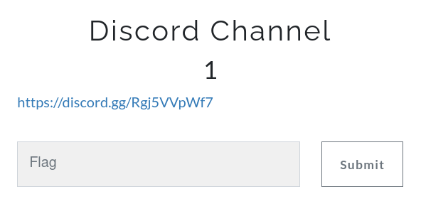

Vào kênh discord [ChristCTF](https://discord.gg/Rgj5VVpWf7) và lấy flag tại đầu kênh `Chém gió`.


Flag: ChristCTF{contactusifyouneed}

### 2. Index 
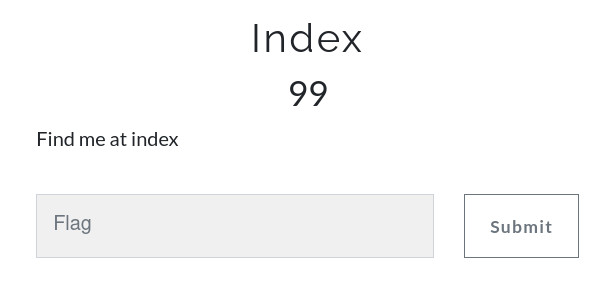

Ta có thể tìm thấy flag tại trang chủ của web: 

Rorate tấm ảnh 90 độ ta có thể thấy được flag ở ngay đó.

Flag: ChristCTF{Welc0me_to_PIS}

### 3. Pha ke Vi Em
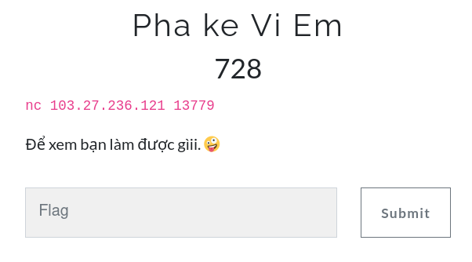

Khi kết nối vào link mình được dẫn tới 1 ubuntu server:

```
Welcome to Ubuntu 18.04.2 LTS (GNU/Linux 4.15.0-55-generic x86_64)
* Documentation:  https://help.ubuntu.com
* Management:     https://landscape.canonical.com
* Support:        https://ubuntu.com/advantage

* Introducing self-healing high availability clusters in MicroK8s.
Simple, hardened, Kubernetes for production, from RaspberryPi to DC.

	https://microk8s.io/high-availability

* Canonical Livepatch is available for installation.
- Reduce system reboots and improve kernel security. Activate at:
https://ubuntu.com/livepatch
77 packages can be updated.
0 updates are security updates.

New release '20.04.1 LTS' available.
-------------------------------------------------------------------------
> Welcome to PIS's self-made Ubuntu virtual machine
> Version:	1.0
> Release Date:	Dec 20 2020
> Developer:	ryh
> Association:	PTITHCM Information Security Club
-------------------------------------------------------------------------
Run 'help' to get instructions
Run 'quit' to exit this virtual machine
-------------------------------------------------------------------------
Spend a while to look around. Enjoy ❤

~$ 
```

Kiểm tra thì mình thấy có sự xuất hiện của 3 file:

```
~$ ls
flag.txt  challenge  challenge.c
~$ file challenge
challenge: setgid ELF 64-bit LSB shared object, x86-64, version 1 (SYSV), dynamically linked, interpreter /lib64/ld-linux-x86-64.so.2, for GNU/Linux 3.2.0, BuildID[sha1]=ed99644fb8c1fdb20487a854fc9c66155ce8c483, not stripped
~$ file flag.txt
flag.txt: ASCII text
~$ file challenge.c
challenge.c: C source, ASCII text
~$ cat flag.txt
Access denied. This incident will be reported.
~$ cat challenge.c
#include <stdio.h>
#include <stdlib.h>
#include <string.h>
char buf[32];
int main(int argc, char* argv[], char* envp[]){
        if(argc<2){
                printf("pass argv[1] a number\n");
                return 0;
        }
        int fd = atoi( argv[1] ) - 0x1234;
        int len = 0;
        len = read(fd,buf,32);
        if(!strcmp("PIS2020\n", buf)){
                printf("good job :)\n");
                system("cat flag.txt");
                exit(0);
        }
        printf("learn about linux file IO\n");
        return 0;
}
~$
```

Ta không thể đọc được file `flag.txt` bằng cách thông thường nhưng ta có thể đọc đoạn code `challenge.c` và ta thấy đoạn code `system("cat flag.txt");`. Vậy là ta có thể lấy được flag thông qua file `challenge`. Mình thấy là để có thể thực hiện được câu lệnh `system()` thì điều kiện `strcmp("PIS2020\n",buf)` trong `if` phải bằng `0` hay `!strcmp()` sẽ bằng 1, nghĩa là `buf` phải bằng với `"PIS2020\n"` lên trên 1 chút thì ta thấy có lệnh `read(fd,buf,32)` nếu như `fd` bằng `0` (file descriptor: 0 for STDIN) thì ta có thể nhập được input từ và khi đó ta sẽ nhập `"PIS2020\n"`. Và có thể thấy là `int fd = atoi(argv[1]) - 0x1234` vậy nên ta sẽ input argument là `0x1234` (Nhưng mà là ở dạng dec :v hay là `4660`). And....

```
~$ ./challenge 4660
PIS2020
good job :)
Submit this flag: ChristCTF{N0w_Y0u_Und3r$tanD_L1nuX_f1l3_IO}
Remember to do your write-up. ❤
~$  
```

Flag: ChristCTF{N0w_Y0u_Und3r$tanD_L1nuX_f1l3_IO}

### 4. Free flag 

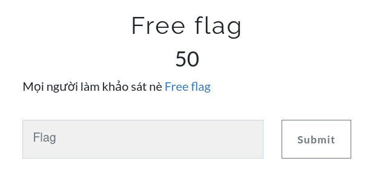

Như đề bài thì mình đã nhận được flag ngay sau khi làm xong phần khảo sát :v 

Flag: ChristCTF{Happy_new_year_2021!Happy_hacking}

## Trivia game

Do dãy chall này khá ngắn nên mình sẽ gộp nó vào làm 1 :v  

* 1. Một câu lệnh được sử dụng thường xuyên nhất trong linux cho phép tạo files, xem nội dung file, nối các file...  
Flag: cat
* 2. Các quyền cơ bản của một user và group trên linux là...  
(đáp án ghi thường, không viết tắt, cách nhau bởi dấu _ , thứ tự các quyền trên câu trả lời đúng theo thứ tự xuất hiện trên máy linux)  
Flag: execute_read_write_deny
* 3. Ai là user quyền lực nhất trên linux? (đáp án viết thường)  
Flag: root
* 4. Làm sao để xem được file ẩn trong linux (Sử dung cách đơn giản và thường gặp nhất) (đáp án viết thường)  
Flag: ls -a
* 5. Ai là cha đẻ của ngôn ngữ C? (Cách viết theo quy tắc tên riêng như thường)  
Flag: Dennis Ritchie
* 6. Phần mở rộng của file thực thi trên linux?  
Flag: elf
* 7. Vùng chứa những dữ liệu được khai báo nhưng chưa gán giá trị? (đáp án ghi thường, viết tắt)  
Flag: bss
* 8. malloc(0x10) cho ta một vùng dữ liệu bao nhiêu bytes? (đáp án dưới dạng số hệ 10)  
Flag: 24

## Reverse 
### 1. Welcome
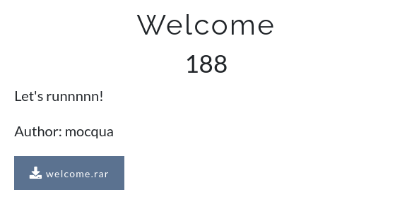  
Khi giải nén tập tin `welcome.rar` ta được file `welcome.exe` và khi run ta sẽ có được flag.
```
b4n4n4 in ~/Downloads λ wine welcome.exe 
ChristCTF{w311c0m3_t0_r3v3sr3}%
b4n4n4 in ~/Downloads λ 
```
Flag: ChristCTF{w311c0m3_t0_r3v3sr3}

### 2. Waiting to new year
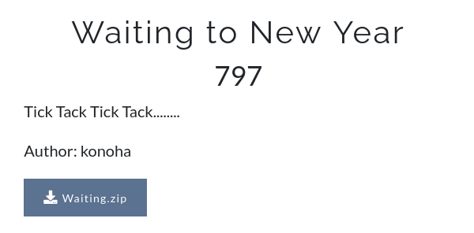  
Khi giải nén file `Waiting.zip` ta nhận được file `Waiting` định dạng ELF và khi chạy thử :v
```
b4n4n4 in ~/Downloads λ ./Waiting
Time has passed without meaning, I want today to be the first day of 2021.

```
Và rất lâu sau đó không có gì xảy ra cả :v mình quyết định quăng file này vào `ida-64` để đọc code cho dễ :v 
khi mình decompile hàm `main()` thì mình nhận được như này :>
```
int __cdecl main(int argc, const char **argv, const char **envp)
{
  __asm { rep nop edx }
  sub_1080(Message, argv);
  PrintFlag((__int64)Message, (__int64)argv);
  return 0;
}
```
Và hàm sub_1080 kia mình không decompile được nên đành đọc code assembly vậy :v
```
.plt.sec:0000000000001080 ; =============== S U B R O U T I N E =======================================
.plt.sec:0000000000001080
.plt.sec:0000000000001080
.plt.sec:0000000000001080 sub_1080        proc near               ; CODE XREF: Flag+18p
.plt.sec:0000000000001080                                         ; PrintFlag+14p ...
.plt.sec:0000000000001080                 rep nop edx
.plt.sec:0000000000001084                 repne jmp cs:printf_ptr
.plt.sec:0000000000001084 sub_1080        endp
.plt.sec:0000000000001084
.plt.sec:0000000000001084 ; ---------------------------------------------------------------------------
.plt.sec:000000000000108B                 align 10h
.plt.sec:0000000000001090
```
Oh vậy đây là hàm in ra màn hình `.__.` vậy dòng chữ hàm này in ra là `Time has passed without meaning, I want today to be the first day of 2021.` ta có thể biết được khi ấn vào `Message` :v  
Tiếp theo là hàm `PrintFlag()`:
```
.text:0000000000001231 ; =============== S U B R O U T I N E =======================================
.text:0000000000001231
.text:0000000000001231
.text:0000000000001231 ; void __cdecl PrintFlag()
.text:0000000000001231                 public PrintFlag
.text:0000000000001231 PrintFlag       proc near               ; CODE XREF: main+1Ep
.text:0000000000001231                 rep nop edx
.text:0000000000001235                 push    rbp
.text:0000000000001236                 mov     rbp, rsp
.text:0000000000001239                 lea     rdi, aWaitingFor5Day ; "\nWaiting for 5 days....."
.text:0000000000001240                 mov     eax, 0
.text:0000000000001245                 call    sub_1080			<== printf_ptr()
.text:000000000000124A                 mov     edi, 69780h
.text:000000000000124F                 mov     eax, 0
.text:0000000000001254                 call    sub_1090			<== sleep()
.text:0000000000001259                 mov     eax, 0
.text:000000000000125E                 call    Flag
.text:0000000000001263                 nop
.text:0000000000001264                 pop     rbp
.text:0000000000001265                 retn
.text:0000000000001265 PrintFlag       endp
.text:0000000000001265
.text:0000000000001266
```
Mình phát hiện ra hàm `sub_1090` là hàm sleep:
```
.plt.sec:0000000000001090 ; =============== S U B R O U T I N E =======================================
.plt.sec:0000000000001090
.plt.sec:0000000000001090
.plt.sec:0000000000001090 sub_1090        proc near               ; CODE XREF: PrintFlag+23p
.plt.sec:0000000000001090                 rep nop edx
.plt.sec:0000000000001094                 repne jmp cs:sleep_ptr
.plt.sec:0000000000001094 sub_1090        endp
.plt.sec:0000000000001094
.plt.sec:0000000000001094 ; ---------------------------------------------------------------------------
.plt.sec:000000000000109B                 align 20h
.plt.sec:000000000000109B _plt_sec        ends
.plt.sec:000000000000109B
```
Và 1 điều nữa là có dòng print bên trên in ra `"\nWaiting for 5 days....."` và mình check thử giá trị của `edx (69780h)` và nó bằng đúng 432000s hay 5 ngày = ))))
PATCH GIÁ TRỊ NÓ VỀ 0 NÀO = )))))
Và sau khi patch giá trị mình đã chạy lại và nhận được flag = ))))  
```
b4n4n4 in ~/Downloads λ ./Waiting    
Time has passed without meaning, I want today to be the first day of 2021.
Waiting for 5 days.....
Flag is: ChristCTF{Wa1t1ng_t0_n3w_y3ar}% 
```
Flag: ChristCTF{Wa1t1ng_t0_n3w_y3ar}

### 3. Merry Christmas
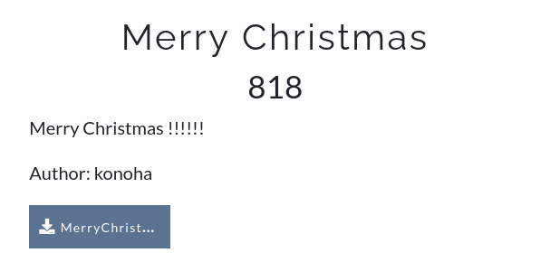  
Khi giải nén `MerryChristmas.zip` mình nhận đc 1 file ELF và khi chạy:
```
b4n4n4 in ~/Downloads λ ./MerryChristmas 
Do you have someone for this Christmas?
Flag is: 
Do you see the flag?
b4n4n4 in ~/Downloads λ 
```
Mình thử tìm string bằng `strings` và phát hiện ra:
```
...
_unused2
stderr
_IO_backup_base
_freeres_list
DebugToFlag				<=== what's this? :>>
main
_IO_write_base
crtstuff.c
deregister_tm_clones
...
```
Vậy là debug là có flag à `.___.` debug thử nào:
```
gdb-peda$ disass main
Dump of assembler code for function main:
   0x000000000000130d <+0>:	endbr64 
   0x0000000000001311 <+4>:	push   rbp
   0x0000000000001312 <+5>:	mov    rbp,rsp
   0x0000000000001315 <+8>:	lea    rdi,[rip+0x2d04]        # 0x4020 <Message>
   0x000000000000131c <+15>:	mov    eax,0x0
   0x0000000000001321 <+20>:	call   0x1090 <printf@plt>
   0x0000000000001326 <+25>:	mov    eax,0x0
   0x000000000000132b <+30>:	call   0x11b9 <Flag>		<=== what's this? :>>
   0x0000000000001330 <+35>:	lea    rdi,[rip+0xcd8]        # 0x200f
   0x0000000000001337 <+42>:	call   0x1070 <puts@plt>
   0x000000000000133c <+47>:	mov    eax,0x0
   0x0000000000001341 <+52>:	pop    rbp
   0x0000000000001342 <+53>:	ret    
End of assembler dump.
```
Disassemble tiếp hàm `Flag` nào:
```
...
   0x00000000000012d0 <+279>:	mov    ecx,edx
   0x00000000000012d2 <+281>:	xor    ecx,eax
   0x00000000000012d4 <+283>:	mov    eax,DWORD PTR [rbp-0x84]
   0x00000000000012da <+289>:	cdqe   
   0x00000000000012dc <+291>:	lea    rdx,[rip+0x2d7d]        # 0x4060 <DebugToFlag>
   0x00000000000012e3 <+298>:	mov    BYTE PTR [rax+rdx*1],cl
   0x00000000000012e6 <+301>:	add    DWORD PTR [rbp-0x84],0x1
   0x00000000000012ed <+308>:	cmp    DWORD PTR [rbp-0x84],0x1a
   0x00000000000012f4 <+315>:	jle    0x12b1 <Flag+248>
   0x00000000000012f6 <+317>:	nop
...
```
Mình thấy đoạn này có vẻ quan trọng này `.___.`
Mình sẽ đặt break point ngay hàm Flag và chạy thử:
```
gdb-peda$ 
[----------------------------------registers-----------------------------------]
RAX: 0x1a 
RBX: 0x555555555350 (<__libc_csu_init>:	endbr64)
RCX: 0x7d ('}')
RDX: 0x555555558060 ("ChristCTF{M3rry_Chr1stmas!}")
RSI: 0x55555555600e --> 0x756f79206f440a00 ('')
RDI: 0x7ffff7fa74c0 --> 0x0 
RBP: 0x7fffffffde20 --> 0x7fffffffde30 --> 0x0 
RSP: 0x7fffffffdd90 --> 0x0 
RIP: 0x5555555552ed (<Flag+308>:	cmp    DWORD PTR [rbp-0x84],0x1a)
R8 : 0x0 
R9 : 0xa ('\n')
R10: 0x555555556004 ("\nFlag is: ")
R11: 0x246 
R12: 0x5555555550a0 (<_start>:	endbr64)
R13: 0x7fffffffdf20 --> 0x1 
R14: 0x0 
R15: 0x0
EFLAGS: 0x206 (carry PARITY adjust zero sign trap INTERRUPT direction overflow)
[-------------------------------------code-------------------------------------]
   0x5555555552dc <Flag+291>:	lea    rdx,[rip+0x2d7d]        # 0x555555558060 <DebugToFlag>
   0x5555555552e3 <Flag+298>:	mov    BYTE PTR [rax+rdx*1],cl
   0x5555555552e6 <Flag+301>:	add    DWORD PTR [rbp-0x84],0x1
=> 0x5555555552ed <Flag+308>:	cmp    DWORD PTR [rbp-0x84],0x1a
   0x5555555552f4 <Flag+315>:	jle    0x5555555552b1 <Flag+248>
   0x5555555552f6 <Flag+317>:	nop
   0x5555555552f7 <Flag+318>:	mov    rax,QWORD PTR [rbp-0x8]
   0x5555555552fb <Flag+322>:	xor    rax,QWORD PTR fs:0x28
[------------------------------------stack-------------------------------------]
0000| 0x7fffffffdd90 --> 0x0 
0008| 0x7fffffffdd98 --> 0x1bf7fe0d50 
0016| 0x7fffffffdda0 --> 0x700000007 
0024| 0x7fffffffdda8 --> 0x1000000052 
0032| 0x7fffffffddb0 --> 0x10000001c 
0040| 0x7fffffffddb8 --> 0x3c00000063 ('c')
0048| 0x7fffffffddc0 --> 0xd00000027 ("'")
0056| 0x7fffffffddc8 --> 0x1300000028 
[------------------------------------------------------------------------------]
Legend: code, data, rodata, value
0x00005555555552ed	22	in /home/konoha/Desktop/MerryChristmas/main.c
gdb-peda$ 
```
Ez :>>>  
Flag: ChristCTF{M3rry_Chr1stmas!}

### 4. theRoom 
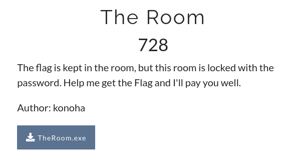  
Bài này đại khái là mình sẽ phải nhập password hợp lý aka Flag thì mới đúng và tìm trong file bằng `IDA` mình thấy có 1 hàm `checkPass()` và mình đã viết hàm để decrypt đoạn này và lấy đc flag = )))))))
```
#include <bits/stdc++.h>
using namespace std;
int main() {
    char temp[] = "X1t`E1toc`Em3H^\"xxxSPFeaHA^I\0";
    char v1;
    int i, j;

    for (i = 0; i <= 15; ++i) {
        if (i & 1)
            v1 = temp[i] - 1;
        else
            v1 = temp[i] + 1;
        temp[i] = v1;
    }
    temp[16] = '_';
    temp[18] = 'x';
    temp[17] = '0';

    for (j = 19; j < strlen(temp); ++j) {
        if (temp[j] > 'I' || temp[j] <= '?')
            temp[j] += 17;
        else
            temp[j] -= 16;
    }
    cout << temp << endl;
    return 0;
}
```  
Flag: ChristCTF{Y0u_F0und_Fl4G_!_0xda6vr81o9}

### 5. Game
  
Do bài này làm mình dỗi nên mình viết ngắn gọn }:<  
Đầu tiên mình `grep -r ChristCTF` và mình ra flag giả trong `level1`  
Mình `strings level1` để xem thử thì thấy 1 link drive.google, và vào thì tải về đc 1 file `*.dat`  
và khi `grep -a Christ *.dat` thì mình đã ra được flag  
Flag: ChristCTF{DanG_COng_San_VIETNAM_Mu0n_NAm}

## Programming
### 1. Ez 
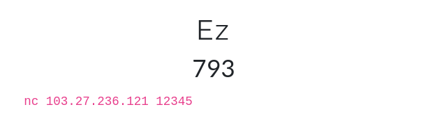  

Khi kết nối đến server mình thấy bài có yêu cầu đó là khi có `merry` thì ta phải nhập `christmas` và đối với `happy` là `new year`  
Mình cũng thử độ chai mặt của mình khi ngồi nhập nhưng có vẻ là cái này trâu hơn r `.__.`  
```
b4n4n4 in ~ λ nc 103.27.236.121 12345
 
Let's play a small game to get the flag
I say 'merry', you say 'christmas'
I say 'happy', you say 'new year'
Let's get it..!! 
#######################################

merry
```
và khi mình nhập sai thì có 1 đoạn khá thú vị 
```
b4n4n4 in ~ λ nc 103.27.236.121 12345
 
Let's play a small game to get the flag
I say 'merry', you say 'christmas'
I say 'happy', you say 'new year'
Let's get it..!! 
#######################################

merry
b4n4n4h4nds0m3
Read the instructions carefully, and learn socket programming to solve this challenge

```
Mình không biết chút gì về socket python cả `.___.` mà từ xưa đã có câu 
```
Học hành thì ấm vào thân
Đi ngủ thì ấm từ chân đến đầu
```
À à lạc đề :>> Thực ra cái gì không biết thì học thôi :>> Sau 1 hồi đọc về socket python và 1 hồi nữa để code và fix bug mình đã hoàn thành em code có khả năng "đấm nhau tay đôi" với bài này :v
```
import socket

HOST = '103.27.236.121'; PORT = 12345
server_address = (HOST, PORT)

with socket.socket(socket.AF_INET, socket.SOCK_STREAM) as s:
	s.connect(server_address)
	data = s.recv(1024).decode("utf-8").split("\n")
	txt = ["new year\n", "christmas\n"]
	if data[-2]=="merry":
		s.send(txt[1].encode())
	else:
		s.send(txt[0].encode())
	while True:
		x=s.recv(1024)
		print(x)
		if x==b'': 
			break
		if (x==b'\nmerry\n'):
			s.send(txt[1].encode())
		else:
			s.send(txt[0].encode())
```
và đây là kết quả sau 1 hồi "đấm nhau" :>>
```
b4n4n4 in ~/Downloads λ py ez.py
b'\nhappy\n'
b'\nmerry\n'
b'\nhappy\n'
b'\nhappy\n'
b'\nhappy\n'
b'\nhappy\n'
b'\nhappy\n'
b'\nhappy\n'
b'\nmerry\n'
b'\nhappy\n'
b'\nmerry\n'
b'\nmerry\n'
b'\nhappy\n'
b'\nhappy\n'
b'\nmerry\n'
b'\nhappy\n'
b'\nhappy\n'
b'\nmerry\n'
b'\nhappy\n'
b'\nhappy\n'
b'\nmerry\n'
b'\nhappy\n'
b'\nhappy\n'
b'\nmerry\n'
b'\nmerry\n'
b'\nmerry\n'
b'\nmerry\n'
b'\nmerry\n'
b'\nmerry\n'
b'\nmerry\n'
b'\nhappy\n'
b'\nhappy\n'
b'\nmerry\n'
b'\nhappy\n'
b'\nhappy\n'
b'\nhappy\n'
b'\nmerry\n'
b'\nmerry\n'
b'\nmerry\n'
b'\nhappy\n'
b'\nhappy\n'
b'\nhappy\n'
b'\nhappy\n'
b'\nhappy\n'
b'\nmerry\n'
b'\nmerry\n'
b'\nmerry\n'
b'\nhappy\n'
b'\nmerry\n'
b"Peace of cake, isn't it!?\nHere you go: \nChristCTF{__Weldone____0xFEEDFACE}\n"
b''
b4n4n4 in ~/Downloads λ 

```
Dăm ba = )))))))))))  
Flag: ChristCTF{__Weldone____0xFEEDFACE}

### 2. !Freedom 
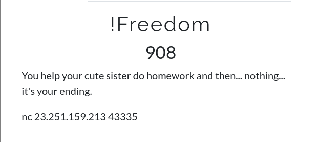  

Khi kết nối vào server mình đã nhận được cái này :v 
```
b4n4n4 in ~/Data/ChristCTF_wu_2020 on main λ nc 23.251.159.213 43335
Baka oniii-chan, can u help me to do math ?
Then u can do anything with me :>
7693 trừ 6417 bằng ?

```
À thì :| ... mình cũng không biết nói gì hơn :v nhưng có vẻ là làm hết đống phép tính thì có thể qua đc chall :>> mình đã thử connect lại vài lần xem có gì khác hay không và mình thấy là có đủ cả `cộng trừ nhân chia` và 1 điều nữa là phép chia chỉ lấy kết quả là phần nguyên :>>
Sau bài `Ez` mình đã có thêm kiến thức để có thể code ra solve của bài này nhưng quả bug tùm lum vẫn làm mình trakmcakm. Và thành quả cuối cùng :v 
```
import socket

HOST = '23.251.159.213'  
PORT = 43335
server_address = (HOST, PORT)

with socket.socket(socket.AF_INET, socket.SOCK_STREAM) as s:
	s.connect(server_address)
	while True:
		data = s.recv(1024).decode("utf-8").split("\n")
		print(data[-2])
		xxx=data[-2].split()
		operations={"chia":int(xxx[0])//int(xxx[2]),"nhân":int(xxx[0])*int(xxx[2]),"cộng":int(xxx[0])+int(xxx[2]),"trừ":int(xxx[0])-int(xxx[2])}
		if xxx[1] in operations:
			senddata=str(operations[xxx[1]])+"\n"
		else:
			print(data)
			break
		print(senddata)
		s.send(senddata.encode())
		
```
Oi khong trẻ em không nên nhìn thấy cái này :((((
```
7406 trừ 4327 bằng ?
3079

6969 trừ 2063 bằng ?
4906

3789 chia 4483 bằng ?
0

5930 nhân 1027 bằng ?
6090110

your jail name is: ChristCTF{ez_like_a_script_kiddie}
['ohh onii-chan so coollllll <3, next is question 1001', 'yeahhh, i done my homework', 'a-re....a-re... are e e e onii-chan, what are u doing? yamete-eeeeeeeee', 'FBI coming up, raise your hands nowwwww !', 'your jail name is: ChristCTF{ez_like_a_script_kiddie}', '']
```
Flag: ChristCTF{ez_like_a_script_kiddie}

### 3. Cây thông noel 
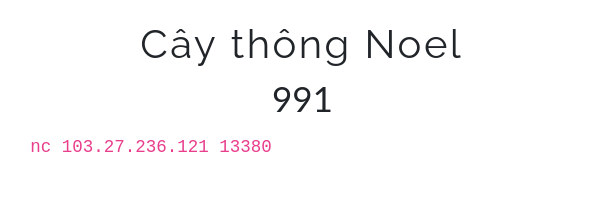  

Well, nhìn cũng bắt mắt màu mè đấy chứ = ))) (ở terminal mới thấy được :v) đó là cảm nghĩ đầu tiên khi mình nhìn vào bài này :v 
```
b4n4n4 in ~/Downloads λ nc 103.27.236.121 13380 
Merry Christmas and Happy New Year!!
 
To prepare for X-Mas, the Json family has saved enough money to buy a christmas tree for decorations.
But everyone can not decide which one to buy. Because all the price tags got disappeared somehow.
The saler said that the price of a tree depends on where he hang the jingle bells, and how many they are.
Note that the bell is '0', and the leaf is '*'
There's only one small tree left:
 
            *
           OO*
          O*O** 
         *O*O***
           |||
        #########
 
        ---------
        |< 41$ >|
        ---------
Can you help us to recover all the price tags? <3
I will pick the tree randomly.
Pleaseeee be quick, there's only 60 seconds left!!!!
Json Ryh, my son, gonna cry like hell if there's no christmas tree this year.
 
Type 'START' to begin:
```
Bài chỉ cho 1 ví dụ nho nhỏ như này nhưng quy luật của nó khá dễ :v Giá tiền sẽ bằng tổng vị trí của các kí tự `O` cộng lại, như ví dụ mẫu sẽ là: `2+3+5+7+11+13=41` và khi bấm `START` mình đã trakmcakm sương sương nên mình quyết định lôi đống data đấy về để xử lý từng chút một.  
Nhưng bài này có 1 đặc điểm đó là nó dùng ANSI để có thể tạo màu cho terminal @@ điều đấy khiến cho việc lấy 1024bytes về để đọc thì cũng vẫn gọi là tù túng = )))
Vậy nên mình đã lên tìm cách để sử lý vụ này đó là dùng 1 vòng while và nhận đến khi nào không nhận được dữ liệu nữa :v 
Sau khi có được đống data mình đã xem xét 1 chút đó là những thứ mà mình cần là `*` và `O` không nằm trong đống mã ANSI kia = )) vậy nên khi lọc ra sẽ không có thiếu xót. Vậy là mình đã dễ dàng tách được riêng `*` và `O` thành 1 chuỗi dài.  
Việc còn lại là điếm và tính tổng thôi = )))))
Mình quăng nó vào while để cho nó auto solve = ))))
```
import socket, time
with socket.socket(socket.AF_INET,socket.SOCK_STREAM) as p:
	p.connect(('103.27.236.121',13380))
	p.recv(1024).decode()
	p.send("START\n".encode())
	while True:
		buff=b""
		time.sleep(0.1)
		while True:
			data=p.recv(1024)
			buff+=data	
			if b'ChristCTF{' in data: 
				print(buff)
				exit(0)
			if b'= ' in data:	break
		x={"*":"*","O":"O"}
		d=[''.join(x[i]) for i in buff.decode() if i in x]
		s=str(sum([i for i in range(1,len(d)+1) if d[i-1]=="O"]))+"\n"
		p.send(s.encode())
		# print(s) # thich nhin hay hay thi uncomment dong nay :v
```
Kết quả:
```
b4n4n4 in ~/Downloads λ py noeltree.py
13887
124211
183706
13887
23592
3831
23592
13887
261222
124211
9523
1593
7982
148827
89672
13887
11599
1060
2127
328
2127
328
89672
42468
261222
55837
3831
124211
183706
41
b'Thankyou, here our present:\nChristCTF{G0ddddd_Ble$$$$$_Y0u_____2510}\nBest wishes!!\n'
```
Flag: ChristCTF{G0ddddd_Ble$$$$$_Y0u_____2510}

## Forensic 
### 1. Noob
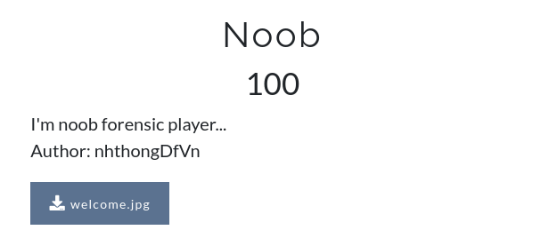  
Chall này rất dễ quăng vào bất kì tool nào dùng để đọc data đều có thể kiếm được flag:
```
b4n4n4 in ~/Downloads λ hexdump -C  welcome.jpg | grep C.h -a5
00000850  00 00 00 00 00 00 00 00  00 00 00 00 00 01 ea 1c  |................|
00000860  00 07 00 00 08 0c 00 00  08 50 00 00 00 00 1c ea  |.........P......|
00000870  00 00 00 08 00 00 00 00  00 00 00 00 00 00 00 00  |................|
00000880  00 00 00 00 00 00 00 00  00 00 00 00 00 00 00 00  |................|
*
00001070  00 00 00 00 00 00 00 00  00 00 00 00 43 00 68 00  |............C.h.|
00001080  72 00 69 00 73 00 74 00  43 00 54 00 46 00 7b 00  |r.i.s.t.C.T.F.{.|
00001090  74 00 68 00 65 00 5f 00  67 00 69 00 6f 00 69 00  |t.h.e._.g.i.o.i.|
000010a0  5f 00 66 00 6f 00 72 00  65 00 6e 00 73 00 69 00  |_.f.o.r.e.n.s.i.|
000010b0  63 00 5f 00 6b 00 68 00  6f 00 6e 00 67 00 5f 00  |c._.k.h.o.n.g._.|
000010c0  64 00 65 00 5f 00 64 00  61 00 75 00 7d 00 00 00  |d.e._.d.a.u.}...|
b4n4n4 in ~/Downloads λ 
```
Flag: ChristCTF{the_gioi_forensic_khong_de_dau}

### 2. Blue christmas
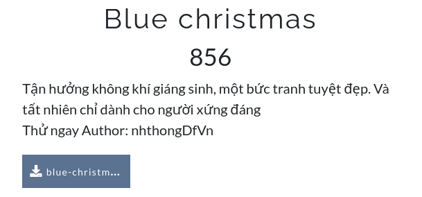  
Huhmmmm mình đã nhận được 1 file data???
```
b4n4n4 in ~/Downloads λ file blue-christmas_-_1 
blue-christmas_-_1: data
b4n4n4 in ~/Downloads λ 
```
Có vẻ không đơn giản chỉ là thế:
```
‰ENN

���
IHDF�����Ð���Ï}ÝV���sRGB�®Îé���gAMA��±üa���	pHYs��ò��òÎ{Þ���tEXtTitle�PDF CreatorA^¼(���tEXtAuthor�PDF Tools AGÏw0�
```
Nhận định ngay của mình đó là `.___.` đây là 1 file ảnh PNG đã bị chỉnh sửa, mình đã sửa tay lại phần IHDR chunk để sau đó sử dụng tool `PRCT` để fix tấm ảnh:
  
Flag: ChristCTF{magic_string_._._1337_._._}

### 3. Nhỏ ơi
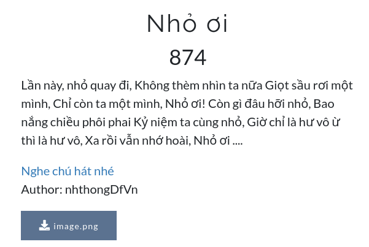  
Khi quăng bài này vào stegsolve mình đã tìm thấy flag tại red plane 0
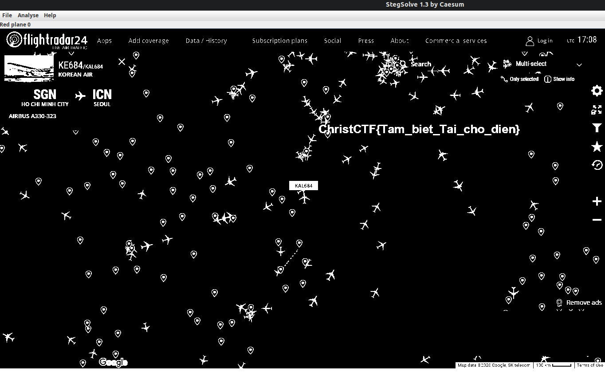  
Flag: ChristCTF{Tam_biet_Tai_cho_dien}

### 4. Tree Tree Tree 
  
Khi quăng vào stegsolve và check qua các trang thì mình phát hiện ở góc có 1 số điểm màu khá dị biệt vậy nên mình đã extract data của đống đấy ra thì walla flag ngay đầu luôn :v 
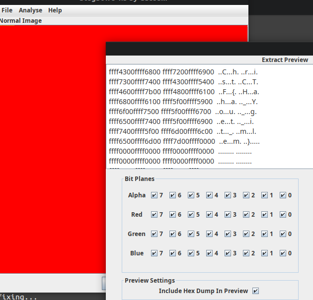  
Flag: ChristCTF{Haha_You_get_it_mlem}

## Crypto

### 1. OSASS
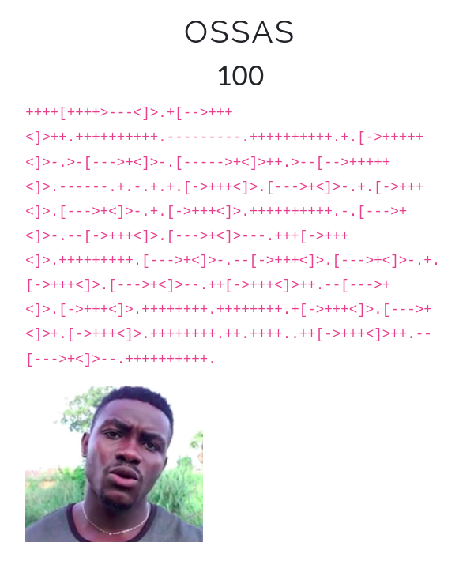  
Dân chơi nhìn phát biết ngay đây là brainfuck, super ezz = ))))
Mình đã tìm ngay 1 tool trên mạng để decode brainfuck = ))))

Flag: ChristCTF{uvuvwevwevweonyetenyevweugwemubwemossas}

### 2. Kt-gy
  
Câu này dùng đến trang web để giải mã khá thông dụng `kt.gy`. Khi pass dòng mật mã vào ASCII đầu tiên ta sẽ đảo ngược chuỗi này trước (ở mục REV của kt.gy), sau đó pass lại 1 lần nữa vào ASCII liền tìm đc flag tại ROT6.

Flag: ChristCTF{dam_ba_cai_crypto_de_ec}

### 3. MONKEY
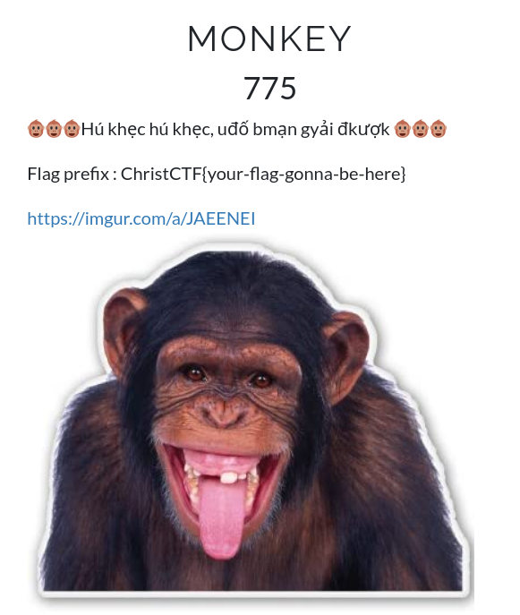  
[dscript](http://dscript.org/dscript.pdf)  
*Khá trakmcakm với bài này @@

Flag: ChristCTF{TRAOTRONYEUTHUONG}

## Web

### 1. web-01
```


<!DOCTYPE html>
<html>
<head>
	<title>Merry Christmas</title>
</head>
<body style="background-image: url(./asset/noel1.jpg);background-repeat: no-repeat;background-attachment: fixed; background-size: 100% 100%;" >
	<div  class="" style="width:500px; margin: 0 auto; float: center;  ">
		
		


		
			<div style="margin-top: 200px; ">
				
				<div style="height: 60px"><a  onmouseover="big()" onmouseout="normal()" id=demo   style="color: white; font-size: 40px;text-decoration: none" href="./?page=gifts">Your Gifts!</a></div>				<br>
				<br>
				<div><a onmouseover="big1()" onmouseout="normal1()" id=demo1  style="color: white; font-size: 40px;text-decoration: none" href="./?page=upload">Upload!</a></div>

			</div>


			<script>
			function big() {
			  document.getElementById("demo").style.fontSize = "50px";
			  document.getElementById("demo").style.transition = "all 0.3s";
			}
			function normal() {
			  document.getElementById("demo").style.fontSize = "40px";
			  document.getElementById("demo").style.transition = "all 0.5s";
			}
			function big1() {
			  document.getElementById("demo1").style.fontSize = "50px";
			  document.getElementById("demo1").style.transition = "all 0.3s";
			}
			function normal1() {
			  document.getElementById("demo1").style.fontSize = "40px";
			  document.getElementById("demo1").style.transition = "all 0.5s";
			}

			</script>


	

	


</div>
<!-- Gift1: ChristCTF{W31(0M3!} -->
</body>
</html>
```
Flag của câu này ở ngay source code của trang :v 

Flag: ChristCTF{W31(0M3!}

### 2. Web-02

Khi vào phần Your Gifts ta thấy trên quả chuối có dòng `GiFt2.php` mình đã thay lên trên thanh địa chỉ và nhận được 
```
 style='color: white'>ITS JUST KIDDING :))
<?php
ob_start();
if (!defined('check_access')) 
{
  header("Location: ./?page=home");
  die("ÔH NÂU!!");
  ob_end_flush();
}
echo "<h1> style='color: white'>ITS JUST KIDDING :)) </h1>";
$flag="christCTF{*******}" ; 

if (isset($_POST['username']) && !empty($_POST['username']) && isset($_POST['password']) && !empty($_POST['password'])){
        $password=$_POST("password");
        $username=$_POST("username");
        if($username==="admin"){
            if($password==="Q2hyaXN0Q1RGe2shRGQhbkchfQ==" && $username!=="admin" ){
                    echo $flag;
            }    
        }
}
else {highlight_file(__FILE__);}        
?> 
```

Decode password `Q2hyaXN0Q1RGe2shRGQhbkchfQ==` ta có flag

Flag: ChristCTF{k!Dd!nG!}